# 📘 README: Next.js Caching & Rendering Masterclass 2025

## 🎯 Overview

A comprehensive tutorial (in Bangla) exploring Next.js rendering strategies and caching mechanisms. Covers key approaches, trade‑offs, and best practices for modern React‑based SSR/SSG/ISR workflows.

---

## 1. Rendering Modes in Next.js


- **SSG**: Fast and cacheable static pages.
- **SSR**: Fully dynamic, per-request rendering.
- **ISR**: Hybrid—static with timed revalidation.
- **CSR**: Pure client‑side hydration for dynamic needs.

---

## 2. Caching Strategies


- Use **CDN** (like Vercel, Cloudflare) to serve static/ISR.
- For ISR, when stale, server asynchronously regenerates.
- SSR always hits server; not cached long-term.

---

## 3. Implementation Patterns

### a) Next.js Data Fetching APIs


- `getStaticProps`: Use for SSG, supports `revalidate` for ISR.
- `getServerSideProps`: Use for SSR dynamic content.
- `getStaticPaths`: Needed for dynamic routes with SSG/ISR.

### b) Caching Headers


- `Cache-Control` headers: `public, max-age=`, `stale-while-revalidate`.
- Ideal for API routes used by client‑side data fetching.

---

## 4. Choosing the Right Mode

```mermaid
pie
    title Choose Rendering
    "Static (SSG/ISR)": 50
    "Server (SSR)": 30
    "Client‑side (CSR)": 20
```



| Use Case       | Best Mode | Notes                          |
| -------------- | --------- | ------------------------------ |
| Blog / docs    | SSG / ISR | Fast, static yet updatable     |
| User dashboard | SSR       | Per‑request data freshness     |
| Interactive UI | CSR / SWR | Client data fetching as needed |

---

## 5. Example: **getStaticProps with ISR**

```js
export async function getStaticProps() {
  const data = await fetch("https://api.example.com/posts");
  return {
    props: { posts: data },
    revalidate: 60, // ISR: regenerate every 60 seconds
  };
}
```

- Builds at compile time.
- Revalidates background at set interval.

---

## 6. Flow: End‑to‑End Request Handling

flowchart TD
  User --> Request[/Route/]
  Request --> CDN{Is cached?}
  CDN -->|Yes| Browser[Delivery]
  CDN -->|No| Server[Next.js app]
  Server --> Renderer[getServerSideProps or ISR]
  Renderer --> Cache[CDN CacheStore]
  Server --> Browser


- Emphasizes decision flow for SSG, ISR, SSR.
- CDN first, fallback to server when missing or stale.

---

## 7. Best Practices & Tips

- Prefer **SSG/ISR** for content-heavy but rarely changing pages.
- Use **SSR** for data that must be up-to-the-minute.
- Integrate client‑side data fetching (React Query, SWR) for interactivity.
- Apply caching headers on API endpoints.
- Monitor build and revalidation times to balance freshness and performance.

---

## 8. Project Diagram


- `/blog`: SSG with ISR, suitable for blog posts.
- `/dashboard`: SSR for user-specific dynamic data.

---

## ✅ Summary

This README synthesizes the key concepts from the Next.js Caching & Rendering masterclass:

- Rendering modes (SSG, SSR, ISR, CSR)
- Caching flows (CDN, revalidation, headers)
- Choosing strategies based on use case
- Example code and request processing diagrams

Let me know if you'd like this expanded into code snippets or file‑structure details!

[1]: https://www.youtube.com/watch?v=K0GT0DcfXIg&utm_source=chatgpt.com "Next.js Caching & Rendering Masterclass 2025 (Bangla) - YouTube"
